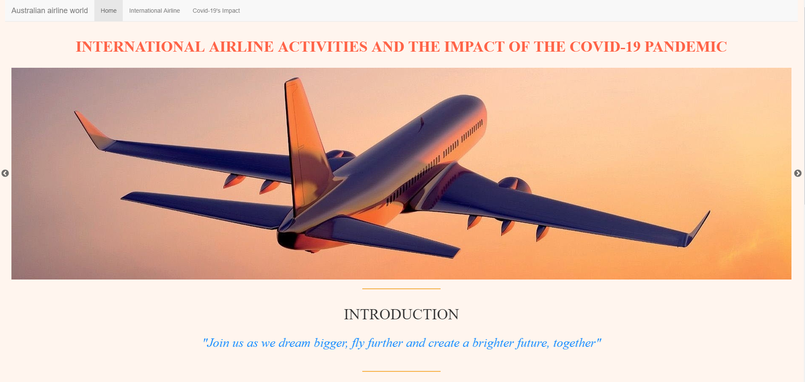
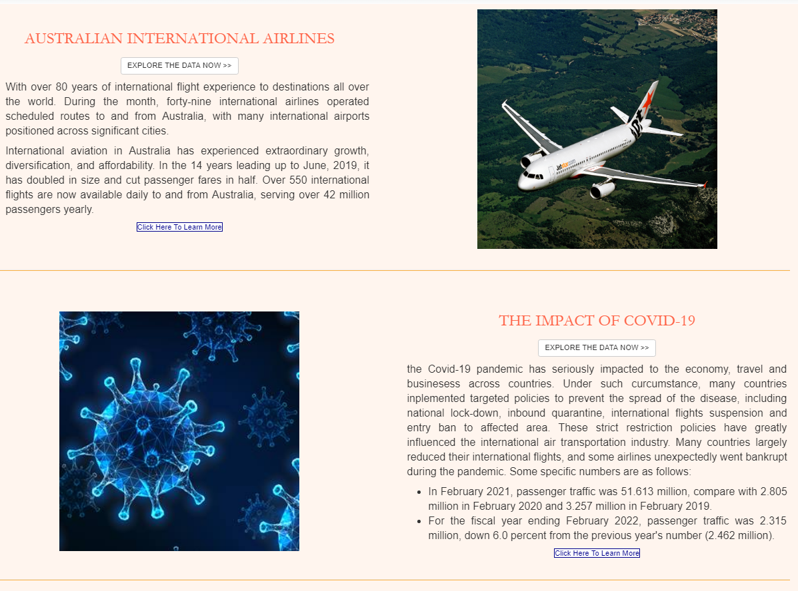
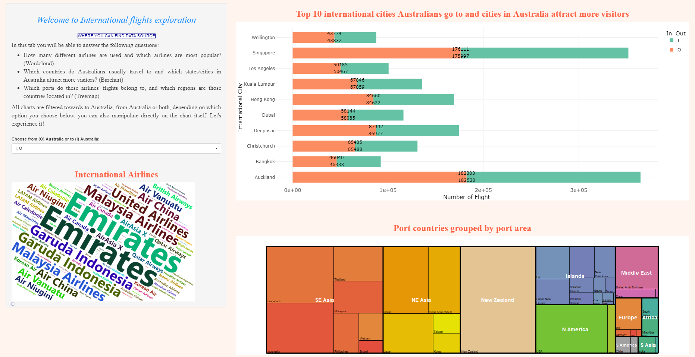
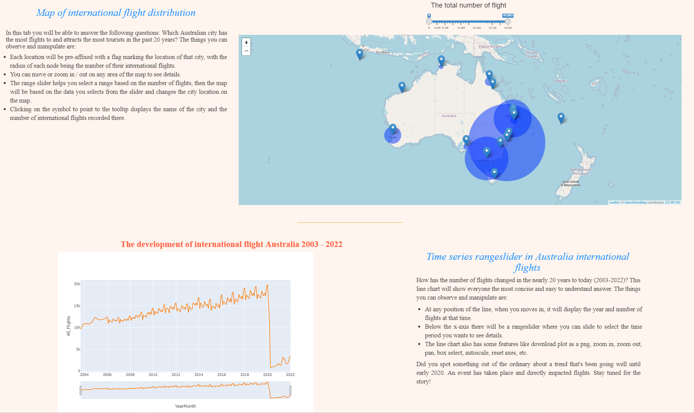
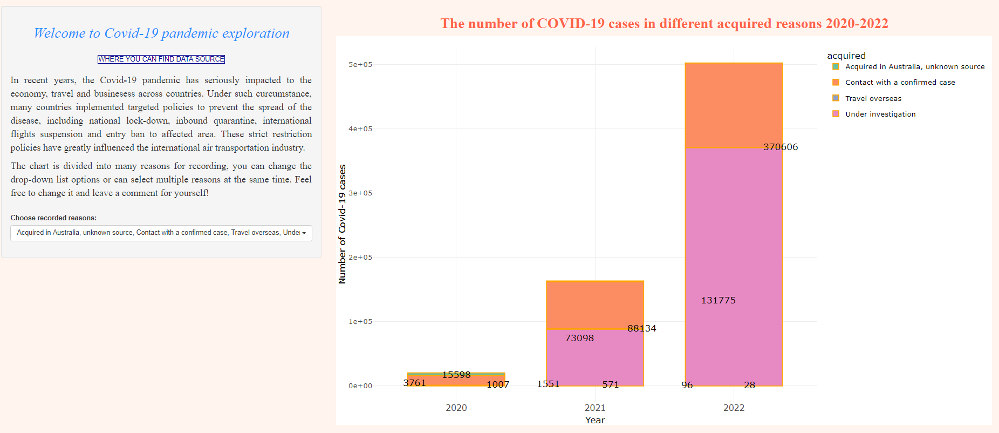
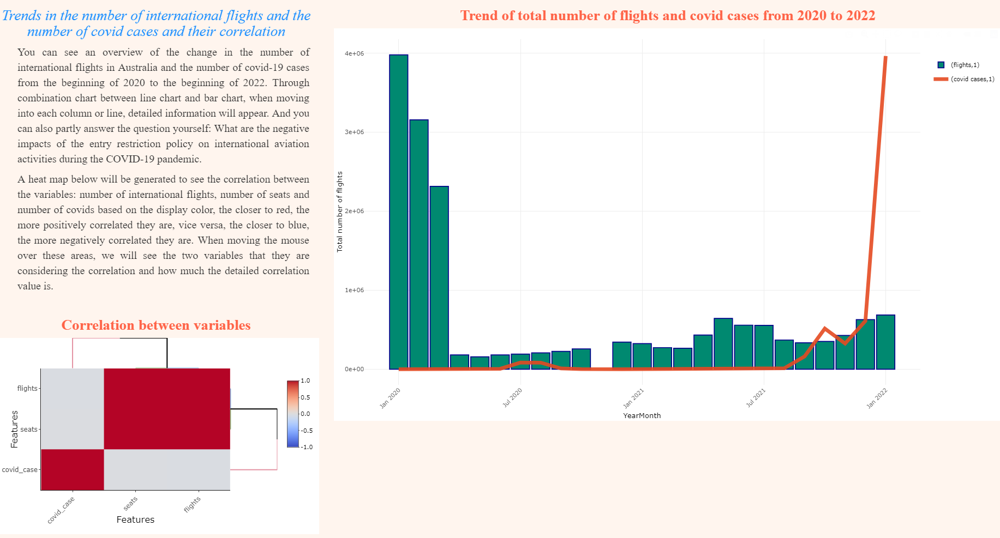

<h1 align="center">
  International airline activities and  
  the impact of the covid-19 pandemic
</h1>

**Project Description**: This project is part of an assignment in the Data Exploration and Visualization course at Monash. In this narrative visualisation, I want to convey the story of international flights in Australia from 2003 to present in 2022 and the impact of the covid-19 pandemic in recent years so that viewers can have a better understanding through animated and interactive charts. Dataset is open data collected from [link1](https://www.data.gov.au/data/dataset/international-airlines-operated-flights-and-seats) and [link2](https://discover.data.vic.gov.au/dataset/all-victorian-sars-cov-2-cases-by-local-government-areapostcode-and-acquired-source). The limitation of this project is that it can only be run locally but this will be fixed in the future.

<h4 align="center">The project is made by Phuc An Nguyen</h4>

| | | |
|:-------------------------:|:-------------------------:|:-------------------------:|
|  title Homepage |   Introduction| 1st tab|
|  2nd tab |   3rd tab | 4th tab|

## Key Features

* View information, links to respective websites
* Sync Scrolling
  - While you type, LivePreview will automatically scroll to the current location you're editing.
* Graph hover and tooltip in Map

## How to Run the Project
Run the `app.R` file on RStudio to start the website

## How To Use

## Credits

This software uses the following open source packages:

- [R](https://cran.r-project.org/bin/windows/base/)
- [tidyverse](https://www.tidyverse.org/)
- [lubridate](https://lubridate.tidyverse.org/)
- [plotly](https://plotly.com/r/)
- [RShiny](https://shiny.rstudio.com/)
- [RStudio](https://posit.co/download/rstudio-desktop/)

